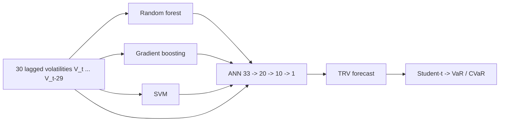

## Abstract

This paper asks whether a volatility forecaster built purely from generic machine-learning regressors can beat the popular recipe of feeding GARCH outputs into a neural network. The authors stack three first-level learners (random forest, gradient boosting, support vector machine) under a small feed-forward network that also sees the last 30 historical volatilities, and call the result Stacked-ANN. It is trained on five eight-year windows of S&P 500 data and judged on the calendar year that follows each window, including the crisis year 2008 and the very calm 2017. Against a plain ANN, ANN-GARCH, ANN-EGARCH and a Heston model, it has the lowest RMSE in all five test years. The authors then turn each volatility forecast into 10-day 99% VaR and CVaR figures and report that theirs is the only model whose Kupiec and both Acerbi–Székely tests are never rejected at the 5% level.

**Keywords:** volatility forecasting, stacking, hybrid models, realised volatility, VaR, CVaR, backtesting

## 1 Introduction

Volatility is the main input of market-risk models, and the paper opens by recalling that the models in use before 2007–2008 badly underestimated it. Because volatility is latent, every study first has to pick a proxy and then a model family. The authors sort the literature into three families: GARCH-type autoregressions, which reproduce volatility clustering but are rigid over long spans; stochastic-volatility models such as Heston, where variance follows its own diffusion; and machine learning.

Within machine learning the dominant idea has been *hybridisation*: fit a GARCH (or EGARCH, GJR, …) first, then pass pieces of it to an ANN alongside other inputs. The paper's objection is that this imports the parametric assumptions of the GARCH step — a chosen innovation distribution and a constant unconditional variance — into a model that was supposed to be flexible. <mark>The proposal is to keep the two-stage idea but replace the econometric first stage with assumption-free learners, so the final network merges forecasts rather than GARCH components.</mark>

## 2 Background

**Benchmarks.** The ANN-GARCH(p,q) benchmark first estimates

$$
\hat\sigma_t^2=\omega+\sum_{i=1}^{q}\alpha_i r_{t-i}^2+\sum_{i=1}^{p}\beta_i\sigma_{t-i}^2 \tag{1}
$$

where $r_t$ is the return, $\sigma_t^2$ the conditional variance and $\omega,\alpha_i,\beta_i$ the parameters; the two sums are then handed to the network as extra features. ANN-EGARCH does the same with the three additive terms of Nelson's log-variance recursion. The stochastic benchmark is Heston:

$$
dX_t=\mu X_t\,dt+\sqrt{\sigma_t^2}\,X_t\,dB_t,\qquad d\sigma_t^2=\theta(\upsilon-\sigma_t^2)\,dt+\delta\,\sigma_t\,dB_t^{*} \tag{2}
$$

with price $X_t$, drift $\mu$, long-run variance $\upsilon$, mean-reversion speed $\theta$, vol-of-vol $\delta$, and Brownian motions $B_t,B_t^*$ correlated by $\rho$. (The text calls the variance process Ornstein–Uhlenbeck; the $\sigma_t$ multiplying the noise makes it the usual square-root form.)

**Risk backtests.** Forecasts are also judged through the risk numbers they imply. VaR exceedances are checked with the Kupiec test (is the count right?) and the Christoffersen test (are they also independent?). CVaR is checked with two Acerbi–Székely tests: AS1, which presumes the VaR is already valid, and AS2, which does not.

## 3 Method

> **Key idea.** Let three off-the-shelf regressors each forecast next-week realised volatility from the last 30 volatilities, then let a small neural network see both those three forecasts and the same 30 raw inputs. No GARCH, no distributional assumption anywhere in the forecasting pipeline.

### 3.1 Target and inputs

The target is the "true realised volatility" over the *next* $n=5$ trading days,

$$
\mathrm{TRV}_t=\sqrt{\frac1n\sum_{i=1}^{n}\bigl(r_{t+i-1}-\bar r_t\bigr)^2} \tag{3}
$$

where $\bar r_t$ is the mean return in that forward window. The features are the backward-looking counterparts

$$
V_t=\sqrt{\frac1n\sum_{i=0}^{n-1}\bigl(r_{t-n+i}-\bar r_t\bigr)^2},\qquad n=5 \tag{4}
$$

for the 30 most recent dates, $V_t,\dots,V_{t-29}$, min–max scaled to $[0,1]$. Five days is argued to be long enough for a stable estimate and short enough not to mix regimes; older lags are dropped because their correlation with the target is negligible.

### 3.2 Two levels, three data blocks

Each eight-year sample is cut chronologically: the first 25% fits the level-one learners (RF, GB with regression trees, SVM with an RBF kernel), the next 50% fits the stacking network, and the last 25% is a test block used to pick hyper-parameters. The following calendar year is the true out-of-sample comparison.

The second level is therefore a function of 33 inputs,

$$
\widehat{\mathrm{TRV}}_{t}^{\text{S-ANN}}=\hat f\bigl(\widehat{\mathrm{TRV}}_{t}^{RF},\widehat{\mathrm{TRV}}_{t}^{GB},\widehat{\mathrm{TRV}}_{t}^{SVM},V_t,\dots,V_{t-29}\bigr) \tag{5}
$$

where $\hat f$ is a feed-forward net with two sigmoid hidden layers of 20 and 10 units and a linear output. It is trained with Adam, full-batch, for 10,000 epochs on an RMSE loss; only the L2 penalty and the initial learning rate are tuned.

### 3.3 Hyper-parameter selection for dependent data

A less advertised but careful part of the paper is tuning. Five schemes are run by grid search for every learner — plain MSE minimisation, circular block bootstrap (CBB), stationary bootstrap (SB), maximum-entropy bootstrap and *h*-block cross-validation — and the one with the lowest error on the later hold-out block wins. ADF statistics (between −4.58 and −8.82) support the stationarity that CBB and SB need. <mark>Across learners and periods the block-bootstrap schemes (CBB, SB) are selected most often</mark>, which the authors read as evidence that resampling which respects serial dependence matters for volatility.

## 4 Experiments

**Setup.** S&P 500 daily data via R's `quantmod`. Training windows 2000–2007, 2001–2008, 2002–2009, 2009–2016 and 2010–2017; test years 2008, 2009, 2010, 2017, 2018. Mean TRV ranges from 0.022 in 2008 down to 0.004 in 2017, so the evaluation spans very different regimes. All ANN-based benchmarks reuse the architecture and tuning of Section 3; GARCH(1,1) and EGARCH(1,1) use Student-*t* innovations; the Heston forecast is the daily average of 20,000 simulated paths.

Out-of-sample RMSE (paper's Table 6):

| Model | 2008 | 2009 | 2010 | 2017 | 2018 |
|---|---|---|---|---|---|
| **Stacked-ANN** | **0.01192** | **0.00534** | **0.00494** | **0.00254** | **0.00544** |
| ANN-EGARCH | 0.01332 | 0.00588 | 0.00537 | 0.00276 | 0.00571 |
| ANN-GARCH | 0.01335 | 0.00584 | 0.00539 | 0.00263 | 0.00575 |
| Heston | 0.02066 | 0.00714 | 0.00547 | 0.00359 | 0.00610 |
| ANN | 0.01526 | 0.00615 | 0.00541 | 0.00274 | 0.00590 |

<mark>Stacked-ANN has the lowest error in every test year</mark>; by my arithmetic the margin over the best GARCH hybrid is about 10% in 2008 and about 3% in 2017. The hybrids generally beat the plain ANN, every model is worst in 2008 and best in 2017, and Heston is last throughout.

**Risk measures.** Each volatility forecast is combined with a Student-*t* return distribution (Heston keeps its own diffusion) to produce 10-day VaR and CVaR at 99%, the Basel setting. From the paper's Table 7, Stacked-ANN's Kupiec p-values are 0.65–0.85, AS1 0.61–0.91 and AS2 0.36–0.69. <mark>It is the only model that passes Kupiec, AS1 and AS2 at the 5% level in all five years</mark>; ANN-GARCH, for example, shows Kupiec p-values of 0.03 or below in four of five years, and Heston is rejected by all four tests in both 2008 and 2009. <mark>The Christoffersen independence test is a different story: Stacked-ANN passes it only in 2009 (p = 0.79) and sits at 0.01–0.02 elsewhere</mark>, because exceedances cluster in time — a failure shared by every model.

## 5 Discussion

**Strengths.** The design is simple and reproducible, the test years were chosen to be uncomfortable, and evaluating forecasts through regulatory-style backtests rather than RMSE alone is the right instinct for a risk paper. The comparison of resampling schemes for tuning is useful beyond this model.

**Weaknesses.** No significance test accompanies the RMSE table, and outside 2008 the gaps are small. With a five-day window, neighbouring targets share four of their five returns, so errors are strongly autocorrelated and the effective sample in one test year is small. The benchmark set omits cheap but strong competitors — a random-walk forecast $V_t$, or a HAR-type regression — so it is unclear how much of the 30-lag information a linear model would already capture. There is one index and no intraday realised measure. Heston is described by the authors themselves as non-predictive, which makes it a weak yardstick. Finally, the clustering of VaR breaches says the model still reacts too slowly when the regime changes, which is exactly when it matters.

**Not shown.** An ablation of the stack (which level-one learner carries the gain? does dropping the raw lags at level two hurt?), sensitivity to $n$, and any result on other assets. The closing suggestion — comparing model volatility with option-implied volatility to find mispriced derivatives — is left as future work.

## 6 Takeaways

- A GARCH-free stack of RF + GB + SVM under a 20–10 network beats ANN-GARCH/EGARCH hybrids on S&P 500 realised-volatility RMSE in all five test years reported.
- Judged by VaR/CVaR backtests, it is the only candidate never rejected by Kupiec, AS1 and AS2 — but, like all the others, it fails the independence test because breaches cluster.
- Block bootstraps (circular, stationary) are the tuning schemes that most often minimise later out-of-sample error on this stationary but persistent series.
- The evidence is one index, no significance tests, and no naive or HAR baseline; treat the ranking as suggestive.
- For generative or stochastic modelling of financial series, the evaluation protocol is the reusable part: push a model's conditional volatility (or its simulated paths) through Kupiec, Christoffersen and Acerbi–Székely tests rather than stopping at a point-error metric. The Heston benchmark here is only a simulated-mean point forecast, so the paper says little about what a well-calibrated stochastic model could do.

## References

1. E. Ramos-Pérez, P. J. Alonso-González, J. J. Núñez-Velázquez. *Forecasting volatility with a stacked model based on a hybridized Artificial Neural Network.* arXiv:2006.16383.
2. T. Bollerslev. *Generalized autoregressive conditional heteroskedasticity.* Journal of Econometrics, 1986.
3. S. Heston. *A closed-form solution for options with stochastic volatility with applications to bond and currency options.* Review of Financial Studies, 1993.
4. C. Acerbi, B. Székely. *Backtesting expected shortfall.* Risk, 2014.
5. D. Politis, J. Romano. *The stationary bootstrap.* Journal of the American Statistical Association, 1994.
