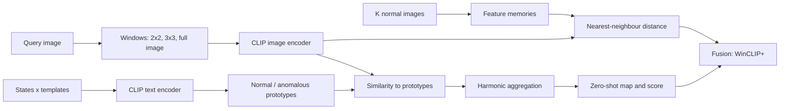

## Abstract

Industrial anomaly detectors are usually trained per product, on hundreds of defect-free images of that product. WinCLIP asks how far one can get with no training at all, using only a pre-trained CLIP and words. It makes two changes to plain CLIP zero-shot classification: the two classes "normal" and "anomalous" are each described by many state phrases crossed with many templates, and the image encoder is run on sliding windows at several sizes so that every location gets a language-aligned embedding. A few-shot variant, WinCLIP+, adds a nearest-neighbour comparison against one to four normal reference images. On MVTec-AD, the zero-shot model reaches 91.8% image AUROC and 85.1% pixel AUROC, and the one-shot model 93.1% and 95.2%, without tuning any weight.

**Keywords:** zero-shot anomaly detection, CLIP, compositional prompt ensemble, sliding windows, harmonic aggregation, few-normal-shot, MVTec-AD, VisA

## 1 Introduction

Visual inspection is a long-tail problem. Products, materials, and defect types differ from one line to the next, and defects are rare. The standard answer is one-class learning: fit a model to many normal images of a single product and flag what deviates. Methods such as PatchCore have nearly saturated MVTec-AD in that regime, but they need a new model and a fresh set of normal images for each task, and their accuracy falls sharply when only a handful of images is available.

The authors argue that language is the missing ingredient. "Normal" and "anomalous" are states of an object, and what counts as a defect depends on context: a hole in cloth is a flaw in one factory and a design feature in another. A pure deviation detector cannot tell a real defect from a harmless variation such as a tolerable scratch, whereas a text prompt can say what matters. CLIP offers an open interface for this, yet <mark>naive CLIP prompts ("normal [object]" versus "anomalous [object]") give only 74.0% AUROC on MVTec-AD</mark>, and CLIP has no dense output that is aligned with text, so segmentation is not directly available.

## 2 Background

**Task.** Anomaly classification (AC) assigns an image a score in $[0,1]$; anomaly segmentation (AS) does the same per pixel. The paper keeps the one-class protocol (no anomalous training images) and studies $K=0$ and $K=1$ to $4$ normal images. It assumes that an object name, and optionally a list of known defect types, is available as text.

**CLIP zero-shot classification.** With image encoder $f$, text encoder $g$, cosine similarity $\langle\cdot,\cdot\rangle$, temperature $\tau$, and a set of candidate sentences $S$:

$$
p(s_i \mid x) = \frac{\exp\big(\langle f(x), g(s_i)\rangle/\tau\big)}{\sum_{s\in S}\exp\big(\langle f(x), g(s)\rangle/\tau\big)} \tag{1}
$$

Averaging the text embeddings of many templates per class is known to help; WinCLIP builds on that idea but changes what is being ensembled.

## 3 Method

> **Key idea.** Treat anomaly detection as a two-way text classification between "this object is fine" and "this object is damaged", describe both sides with many phrasings, and ask the question not once per image but once per local window, so that the answer becomes a map.

### 3.1 Compositional prompt ensemble

Each class is a Cartesian product of state phrases and templates. The normal side has seven states (for example "flawless [o]", "[o] without defect"), the anomalous side four ("damaged [o]", "[o] with flaw"), and there are 22 templates, some written for this task ("a photo of a [c] for visual inspection"). All combinations are encoded and averaged into one normal and one anomalous prototype; Eq. (1) over these two prototypes gives the zero-shot score $\mathrm{ascore}_0(f(x))$. Task-specific states such as "bad soldering" can be added when known. The ablation shows the two-class framing is essential: <mark>using only the "normal" prompt as a one-class score gives 34.2% AUROC, the two-class version 74.0%, and adding the state ensemble lifts it to 89.8%</mark>.

### 3.2 Window-based dense features

ViT patch tokens from CLIP's last layer are a tempting dense feature, but they were never trained against text and already mix global context. WinCLIP instead masks the image with a binary window $w_{ij}$ (a $k\times k$ block of patches around position $(i,j)$) and takes the class-token embedding of what remains:

$$
F^{W}_{ij} = f(x \odot w_{ij}) \tag{2}
$$

Because masked patches can simply be dropped before the transformer, as in MAE, this is much cheaper than cropping and resizing tiles. Each window receives a score $M^{W}_{0,uv}$ from the text prototypes, and every pixel combines the scores of all windows covering it with a harmonic mean, which leans towards the most "normal" vote:

$$
\bar M^{W}_{0,ij} = \left(\frac{1}{\sum_{u,v}(w_{uv})_{ij}}\sum_{u,v}\frac{(w_{uv})_{ij}}{M^{W}_{0,uv}}\right)^{-1} \tag{3}
$$

Three scales are fused, again harmonically: $2\times2$ patches (32×32 pixels), $3\times3$ patches (48×48), and the whole image. The layout of windows and class tokens is drawn in [Fig. 3 in the paper](https://arxiv.org/pdf/2303.14814#page=4).

### 3.3 WinCLIP+ with a few normal images

Some defects cannot be put into words: a metal nut "flipped upside-down" is only wrong relative to a correct one. WinCLIP+ stores features of the $K$ normal images in a memory $R$ and scores each query location by its distance to the closest stored feature:

$$
M_{ij} = \min_{r\in R}\tfrac12\big(1-\langle F_{ij}, r\rangle\big) \tag{4}
$$

This is done for small windows, mid windows, and the patch tokens (useful here even though they are not text-aligned), the three maps are averaged into $M^{W}$, and the result is fused with the language map. The image-level score mixes both sources:

$$
\mathrm{ascore}_W(x) = \tfrac12\Big(\mathrm{ascore}_0(f(x)) + \max_{ij} M^{W}_{ij}\Big) \tag{5}
$$

The full pipeline is shown in [Fig. 4 in the paper](https://arxiv.org/pdf/2303.14814#page=5). In outline:

## 4 Experiments

**Setup.** MVTec-AD and VisA; OpenCLIP ViT-B/16+ pre-trained on LAION-400M, input resized to 240 on the shorter side, window stride of one patch. Metrics are AUROC, AUPR, and F1-max for images, and pixel AUROC, PRO, and F1-max for pixels. Few-shot numbers are averaged over five seeds. No weight is trained in any setting.

Main results (AUROC for AC, pixel AUROC for AS, mean ± std):

| Setup | Method | MVTec AC | MVTec AS | VisA AC | VisA AS |
|---|---|---|---|---|---|
| 0-shot | CLIP-AC | 74.0 | – | 59.3 | – |
| 0-shot | MaskCLIP | – | 63.7 | – | 60.9 |
| 0-shot | **WinCLIP** | **91.8** | **85.1** | **78.1** | **79.6** |
| 1-shot | SPADE | 81.0±2.0 | 91.2±0.4 | 79.5±4.0 | 95.6±0.4 |
| 1-shot | PaDiM | 76.6±3.1 | 89.3±0.9 | 62.8±5.4 | 89.9±0.8 |
| 1-shot | PatchCore | 83.4±3.0 | 92.0±1.0 | 79.9±2.9 | 95.4±0.6 |
| 1-shot | **WinCLIP+** | **93.1±2.0** | **95.2±0.5** | **83.8±4.0** | **96.4±0.4** |
| 4-shot | PatchCore | 88.8±2.6 | 94.3±0.5 | 85.3±2.1 | 96.8±0.3 |
| 4-shot | **WinCLIP+** | **95.2±1.3** | **96.2±0.3** | **87.3±1.8** | **97.2±0.2** |

<mark>Zero-shot WinCLIP beats the 4-shot image-level scores of SPADE, PaDiM, and PatchCore on MVTec-AD</mark>, and 4-shot WinCLIP+ matches full-data CutPaste (95.2 AC), though it remains well below full-data PatchCore (99.6 AC, 98.2 AS).

**Ablations.** The prompt gains stack as 74.0 → 89.8 (states) → 90.8 (templates) → 91.8 (multi-crop). For dense features, <mark>raw patch tokens give only 22.4% pixel AUROC, image tiling 77.9% at about 1442 ms per image, and windows 85.1% at about 389 ms</mark>. Removing harmonic averaging costs 3.6 points of pixel AUROC, and removing the image-scale term 3.1. In WinCLIP+, the language score still helps at 8 shots (94.5 → 96.3 AC). Adding defect-specific state words on VisA raises mean AUROC from 78.1 to 78.9, with PCB2 moving from 51.2 to 56.5.

## 5 Discussion

**Strengths.** The method is training-free and built from public parts, so deploying it on a new product is a matter of writing an object name. The ablations isolate each component cleanly, and the comparison against patch tokens and tiling explains why the window construction matters instead of just asserting it. Showing that the language term remains useful as shots increase supports the claim that text and reference images carry different information.

**Weaknesses.** The authors themselves point out that pixel AUROC flatters the results: <mark>even the best few-shot model stays below 60% pixel F1-max, and zero-shot F1-max is 31.7% on MVTec-AD and 14.8% on VisA</mark>, so low-shot segmentation is far from solved. VisA zero-shot classification (78.1%) is much weaker than MVTec-AD, and the reported failure cases are telling: logical anomalies such as a missing component, very small defects, and harmless deviations that get flagged anyway. Windows of 32 and 48 pixels on a 240-pixel input set a floor on spatial resolution. Roughly 0.4 s per image is slow for an inline inspection station.

**Not shown.** The prompt lists were curated by hand, and the paper does not report sensitivity to that choice beyond the state/template ablation. The output is still a score, so an operating threshold must come from somewhere; this is the gap AnomalyGPT later targets. There is no test of whether CLIP's web pre-training has already seen the benchmark categories.

## 6 Takeaways

- Framing anomaly detection as "normal versus damaged" in text, rather than as distance from normal, is what unlocks CLIP here; the one-class prompt alone scores below 50% AUROC.
- Ensembling over state words matters far more than ensembling over templates.
- Language alignment lives in the class token, so dense language-aligned features are best obtained by recomputing that token on masked windows, not by reading out patch tokens.
- Text and a few reference images are complementary: text names the defect, references define what the intact object looks like.
- High pixel AUROC hides poor F1 under heavy class imbalance; the same caution applies to any rare-event detector.

## References

1. Jeong, J., Zou, Y., Kim, T., Zhang, D., Ravichandran, A., Dabeer, O. *WinCLIP: Zero-/Few-Shot Anomaly Classification and Segmentation.* CVPR 2023. arXiv:2303.14814.
2. Radford, A. et al. *Learning Transferable Visual Models From Natural Language Supervision.* ICML 2021. arXiv:2103.00020.
3. Roth, K. et al. *Towards Total Recall in Industrial Anomaly Detection* (PatchCore). CVPR 2022.
4. Defard, T. et al. *PaDiM: a Patch Distribution Modeling Framework for Anomaly Detection and Localization.* ICPR 2021. arXiv:2011.08785.
5. Zou, Y. et al. *SPot-the-Difference Self-Supervised Pre-training for Anomaly Detection and Segmentation* (VisA). ECCV 2022.
